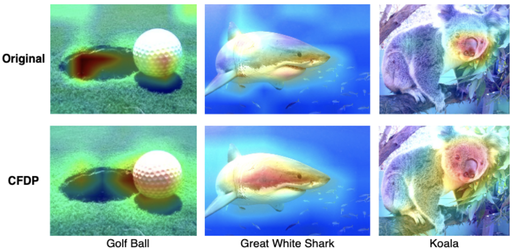

# CFDP: Common Frequency Domain Pruning


                                          Samir Khaki, Weihan Luo
                                          University of Toronto
                                            Toronto, Canada
                              {samir.khaki, weihan.luo}@mail.utoronto.ca

<!-- ## We are preparing for other deadlines, if you want the pre-released code for CFDP, please feel free to email us! Thanks! -->

Pytorch implmentation of CFDP (CVPR 2023).


*This figure shows CFDP method computation for layeri based on feature maps F_i and the associate transformation into layeri' (the pruned layer). Further information discussed in the main paper -- Section 3.6*


## Citation
If you find CFDP useful in your research, please consider citing:

```
@InProceedings{Khaki_2023_CVPR,
    author    = {Khaki, Samir and Luo, Weihan},
    title     = {CFDP: Common Frequency Domain Pruning},
    booktitle = {Proceedings of the IEEE/CVF Conference on Computer Vision and Pattern Recognition (CVPR) Workshops},
    month     = {June},
    year      = {2023},
    pages     = {4714-4723}
}
```

## Running Code

In this code, you can run our models on CIFAR-10 and ImageNet dataset.

### Score Generation

```shell
python score_generation.py \
--pretrain_dir [pre-trained model dir] \
--arch [model arch name] \
--limit [batch numbers] \
--alpha [balancing hyperparamter] \
```
This script generates the scores for all channels in each conv layer. The scores are indicative of the channels perofrmance and how much information it can contribute. Based on the compressionr rate specified in the evaluation, our framework selects the top k channels ranked in descending order by their scores.


### Model Training

For the ease of reproducibility. we provide some of the experimental results and the corresponding pruned rate of every layer directly from our paper below:
#### Attention! The actual pruning rates are much higher than these presented in the paper since we do not count the next-layer channel removal (For example, if 50 filters are removed in the first layer, then the corresponding 50 channels in the second-layer filters should be removed as well).

##### 1. VGG-16

|  Params      | Flops         | Accuracy |
|--------------|---------------|----------|
| 2.76M(81.6%) | 131.17M(58.1%)| 94.10%   | 

```shell
python evaluate_cifar.py \
--job_dir ./result/vgg_16_bn/[folder name] \
--resume [pre-trained model dir] \
--arch vgg_16_bn \
--compress_rate [0.21]*7+[0.75]*5
```
##### 2. ResNet56

|  Params      | Flops        | Accuracy |
|--------------|--------------|----------|
| 0.66M(22.3%) | 90.35M(50.0%)| 93.97%   | 

```shell
python evaluate_cifar.py \
--job_dir ./result/resnet_56/[folder name] \
--resume [pre-trained model dir] \
--arch resnet_56 \
--compress_rate [0.]+[0.18]*29
```
##### 3. GoogLeNet

|  Params      | Flops        | Accuracy |
|--------------|--------------|----------|
| 2.86M(53.5%) |  0.65B(57.2%)| 95.25%   | 

```shell
python evaluate_cifar.py \
--job_dir ./result/googlenet/[folder name] \
--resume [pre-trained model dir] \
--arch googlenet \
--compress_rate [0.3]+[0.6]*2+[0.7]*5+[0.8]*2
```
##### 4. ResNet50 -- (ImageNet)

|  Params | Flops| Acc Top1 |Acc Top5 |
|---------|------|----------|----------|
| 15.09M  |2.26B |    76.10%| 92.93% |

```shell
python evaluate_imagenet.py \
--dataset imagenet \
--data_dir [ImageNet dataset dir] \
--job_dir./result/resnet_50/[folder name] \
--resume [pre-trained model dir] \
--arch resnet_50 \
--compress_rate [0.]+[0.1]*3+[0.35]*16
```

## Other relevant optional arguments
```
optional arguments:
    --lr			initial learning rate
    				default: 0.01
    --lr_decay_step		learning rate decay step
				default: 5,10
    --epochs			The num of epochs to train.
    				default: 30
    --train_batch_size		Batch size for training.
    				default: 128
    --eval_batch_size		Batch size for validation. 
				default: 100
    --compress_rate 		compress rate of each conv
```


## GradCam Visualizations



*This figure shows 3 images sampled from ImageNet [7] with attention maps overlayed for both the Original and CFDP pruned versions of the ResNet-50 architecture. Despite the significant pruning of the architecture by almost 50% in parameters, it is able to create a reduced n-dimensional embedding space that retains the importance of feature recognition from the original 512-dimensional embedding space (and in some cases, improves it). Refer to the main paper for more information.*

## Acknowledgement 

This project source code is based on https://github.com/lmbxmu/HRank.
